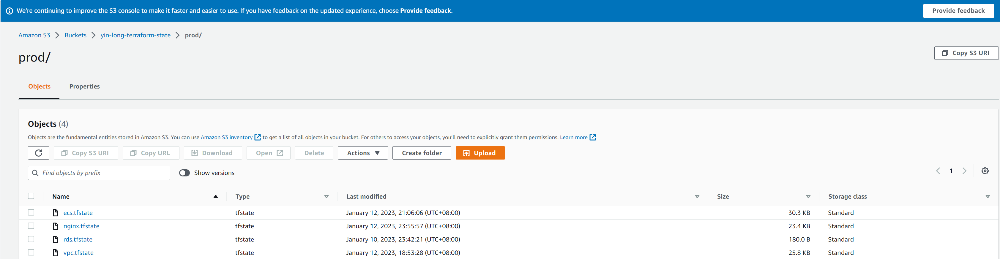

# terraform-ecs
Provision ECS platform for Fargete apps

## Provision VPC
```shell
cd vpc && terraform apply -var-file=prod.tfvars 
```

## Provision RDS
```shell
cd rds && terraform apply -var-file=prod.tfvars 
```

## Provision ECS platform
```shell
cd ecs && terraform apply -var-file=prod.tfvars 
```

## deploy services on the ECS platform
```shell
cd example-service && sh deploy.sh deploy 
```

# s3 remote state files
